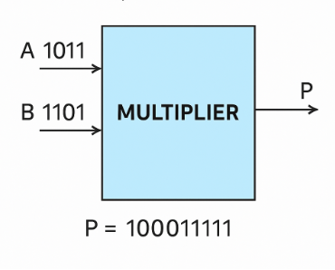

**Verilog**

Verilog is language commonly used in designing digital systems. It is a hardware description language, which means that it is substantially different from any other language you might have encountered so far. Even though it does have control flow statements and variables, it relies primarily on logic functions. It is a textual format for describing electronic circuits and systems.  

Verilog has evolved as a standard hardware description language. Verilog offers many useful features for hardware design. It is easy to learn and easy to use as it is similar to C Programming language. Designers with C Programming experience will find it easy to learn Verilog.  

**Multiplier**

This module explains how to build multiplier circuits using verilog. A **multiplier** is a digital circuit that performs multiplication of binary numbers. Multipliers are essential components in digital signal processing, arithmetic logic units, and various other applications requiring mathematical operations. The multiplier circuit is more complex than an adder but is fundamental for many digital systems.

