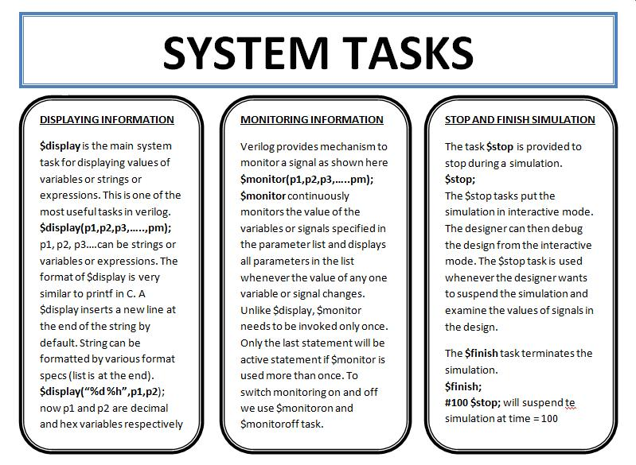
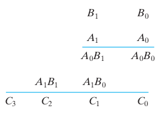
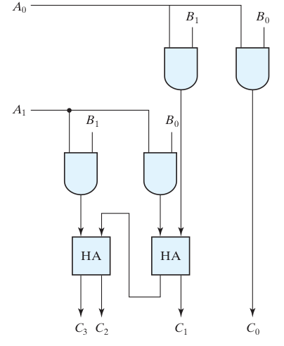
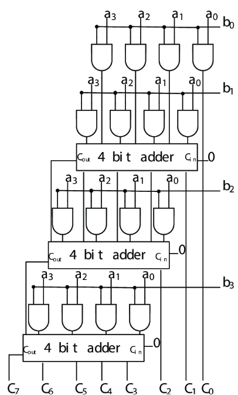

This page provides an overview of Verilog, its significance, and practical examples of digital design using Verilog. We will explore three fundamental designs in this experiment:

1. **T-Flip Flop**
2. **Counter**
3. **T-Flip Flop Using D-Flip Flop**

---

Verilog is a hardware description language (HDL) developed to model electronic systems. It enables designers to describe the structure and behavior of digital circuits, facilitating simulation, synthesis, and verification. The modular nature of Verilog allows for efficient design, testing, and reuse of code.

---

## 1. T-Flip Flop

The Verilog code for a T-Flip Flop is shown below, accompanied by an explanation of its components:

<p align="center">
  
</p>

### Key Concepts

- **Module:**  
  A module is the fundamental building block in Verilog. It can represent a single element or a collection of lower-level design blocks. Modules encapsulate functionality and expose interfaces through input and output ports, allowing for abstraction and reuse.

- **Module Name:**  
  The module name is user-defined and is used to instantiate the module elsewhere in the design. Instantiation is demonstrated in the third example.

- **Module Arguments:**  
  Similar to function arguments in C, module arguments specify the input and output ports used for communication with other modules or the external environment.

- **Input/Output Ports:**  
  These ports facilitate data transfer into and out of the module. All arguments listed in the module declaration must be defined as either input or output within the module.

- **Data Types:**  
  In this example, the `reg` data type is used. Other data types, such as `wire`, will be introduced in subsequent examples. Refer to the chart below for an overview of Verilog data types:

  <p align="center">
    
  </p>

- **Always Block:**  
  The `always` block contains statements that execute repeatedly, triggered by changes in specified signals (e.g., clock or reset).

- **Posedge Clock:**  
  The `posedge` (positive edge) of the clock triggers the execution of statements within the `always` block, corresponding to a transition from low to high voltage.

- **Negedge Reset:**  
  The `negedge` (negative edge) of the reset signal asynchronously sets the output to zero, regardless of the clock.

- **Operators and Lexical Conventions:**  
  Operators such as `~` (bitwise NOT) and `!` (logical NOT) are used in Verilog. The chart below summarizes various operators and conventions:

  <p align="center">
    
  </p>

- **Loops:**  
  Verilog supports control structures such as `for`, `if-else`, and `while`, similar to C. These structures use `begin` and `end` to define statement blocks.

- **Blocking and Non-Blocking Assignments:**
  - **Blocking (`=`):** Statements execute sequentially.
  - **Non-Blocking (`<=`):** Statements execute concurrently.  
    For example:
    ```
    a = b;
    b = a;
    ```
    Both `a` and `b` will have the value of `b`.  
    Using non-blocking assignment:
    ```
    a <= b;
    b <= a;
    ```
    The values are swapped simultaneously.

---

## 2. Counter

The Verilog code for a counter is provided below, with explanations for each part:

<p align="center">
  
</p>

### Additional Notes

- **Assign Statement:**  
  The `assign` keyword is used for continuous assignment. For example, `assign Q = tmp;` ensures that `Q` is updated immediately whenever `tmp` changes, regardless of execution sequence.

---

## 3. T-Flip Flop Using D-Flip Flop

The Verilog code for implementing a T-Flip Flop using a D-Flip Flop is shown below:

<p align="center">
  
</p>

### Key Concepts

- **Module Instantiation:**  
  Modules are not defined within other modules; instead, they are instantiated (called) as needed. The module is referenced by its original name, but each instance must have a unique identifier. For example, the module `D_FF` is instantiated as `dff0`.

- **Verilog Primitives:**  
  Verilog provides built-in primitives such as `not`. In `not (d, q);`, `d` is the output and `q` is the input.

- **Compiler Directives and System Tasks:**  
  While not used in the above examples, Verilog supports compiler directives and system tasks for advanced functionality. Refer to the flowcharts below for more information:

  <p align="center">
    
  </p>
  <p align="center">
    
  </p>

---

## Binary Multiplier

Binary multiplication is performed similarly to decimal multiplication. Starting with the least significant bit, the multiplicand is multiplied by each bit of the multiplier, producing partial products. Each partial product is shifted left according to its position, and the sum of all partial products yields the final result.

### 2-Bit Multiplier

Consider the multiplication of two 2-bit binary numbers. Let B1 and B0 be the multiplicand bits, A1 and A0 the multiplier bits, and C3 C2 C1 C0 the product bits. Multiplying B1 B0 by A0 produces the first partial product. Each bit multiplication (e.g., A0 and B0) is equivalent to an AND operation, so AND gates are used to generate the partial products. Multiplying B1 B0 by A1 and shifting left by one position gives the second partial product. The two partial products are then added using half-adder (HA) circuits.

<p align="center">
  
</p>

<p align="center">
  <em>Circuit diagram for 2-bit multiplier using half adders and AND gates</em>
</p>

<p align="center">
  
</p>

### 4-Bit Multiplier

A 4-bit multiplier multiplies two 4-bit binary numbers, producing a maximum product of 225 (i.e., 15 × 15). Let the multiplicand be A3 A2 A1 A0, the multiplier B3 B2 B1 B0, and the product P7 P6 P5 P4 P3 P2 P1 P0.

In a 4×4 multiplier, there are four partial products, each generated by multiplying the multiplicand by one bit of the multiplier and shifting accordingly. These partial products are summed to obtain the final product. The addition can be performed using single-bit adders (half-adders and full-adders), but the design becomes complex as the number of bits increases.

<p align="center">
  
</p>

### Shift Multiplier

The shift-and-add multiplier algorithm is similar to the manual multiplication method. It is commonly used in computers for multiplying large binary numbers, such as 32-bit values, where designing a direct combinational circuit is impractical. The algorithm processes the multiplier bits from least significant to most significant, recursively shifting and adding partial products.

<p align="center">
  
</p>
